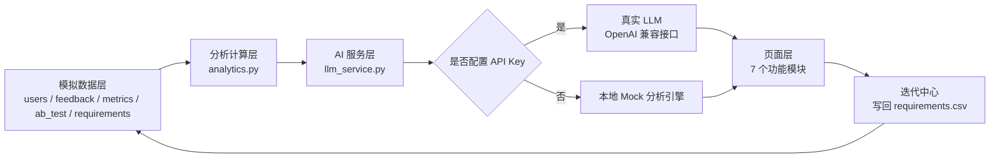
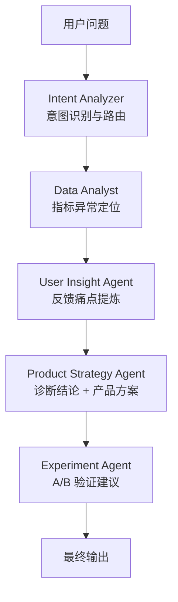

# AI Product Intelligence

**AI 产品智能增长与体验优化平台**

一个面向 AI 产品经理 / 产品团队的智能产品分析平台 Demo。它不是聊天机器人，而是模拟真实 AI 产品团队的工作流程：
从用户反馈与产品数据出发，完成 **用户洞察 → 问题诊断 → 体验评测 → 需求优先级 → 产品方案 → A/B 实验 → 迭代闭环**。

**本项目的分析对象**：一款虚构的 AI 游戏陪伴助手（原型来自个人项目 GameBuddy）——面向游戏玩家的 AI 陪伴产品，
覆盖连败情绪陪伴、对局复盘、攻略问答与开黑组队场景。产品档案定义在 `utils/product.py`，可随时替换为其他产品。

所有数据均为模拟数据，运行不依赖数据库，未配置 API Key 时自动使用本地 Mock 分析引擎，功能完整可演示。

---

## 一、项目介绍

AI 产品经理日常面临的真实困境是：指标、用户反馈、实验数据散落在不同工具里，从“发现问题”到“形成方案”缺少一条可复用的链路。

本项目把这条链路产品化：把指标异常检测、用户反馈聚类、AI 回答质量评测、RICE 需求评分、A/B 实验分析整合到一个后台里，
让产品经理可以在一个页面内完成 **从数据到决策** 的完整推演，并且每一步结论都可以追溯到具体数据。

它不是“让 AI 随便写一段分析”，而是：**先算数，再让 AI 解释数据。**

选择 AI 游戏陪伴助手作为分析对象，是因为这个品类的核心矛盾非常典型：
玩家在**情绪最强的时刻**（连败、卡关）打开产品，想要的其实是被接住，而不是一份长建议；
一旦 AI 开始讲道理或回复过长，对话就在几轮内结束。本项目把这套判断用指标和反馈数据完整地跑了一遍。

---

## 二、产品解决什么问题

| 真实痛点 | 本项目给出的解法 |
| --- | --- |
| 用户反馈量大，靠人工读读不完 | 反馈自动聚类成 6 类问题，输出负面率与占比 |
| 指标异常了，但不知道问题出在哪个环节 | 指标异常 + 反馈聚类交叉定位，给出证据链 |
| AI 回答质量好坏只能靠感觉 | 五个维度量化评测（准确性 / 意图 / 完整性 / 简洁性 / 可执行性） |
| 需求优先级靠“谁嗓门大” | RICE 评分模型，展示完整计算过程 |
| A/B 实验只会看涨跌，不会判断是否可信 | 自动计算变化率与 p 值，区分显著与不显著 |
| 需求从提出到上线没有闭环 | 迭代中心：需求池 → 开发 → 实验 → 上线 → 数据验证 |

---

## 三、核心功能

### 1. 产品总览 Dashboard
- AI 产品健康度综合评分（由满意度、回答有效率、留存、反馈健康度加权计算）
- DAU / 次日留存 / 用户满意度 / AI 回答有效率，含 30 天变化
- 近 30 天核心指标趋势，可切换指标
- **AI 自动发现的问题**：由指标异常自动触发，标注 P0/P1/P2、影响指标、影响用户、趋势与建议

### 2. 用户洞察
- 支持按用户类型、使用场景、评分范围筛选
- 高频问题分布、各类型负面反馈率、用户构成
- 一键生成 AI 用户洞察：高频痛点、用户需求、用户情绪、使用场景、潜在产品机会
- **反馈录入**：支持手动录入单条反馈与批量导入 CSV，新数据立即进入同一套分析流程（自动问题分类 + 自动去重），可现场把面试官给的真实反馈贴进来跑一遍

### 3. AI 体验评测
- 输入用户问题与 AI 回答，输出五维评分 + 雷达图
- 内置三个游戏陪伴场景的对比示例：连败吐槽被回复了 500 字（简洁性 60 分）、星露谷没目标的简洁共情（83 分）、
  “抱抱你，你已经很棒了”式模板安慰（65 分，意图匹配只有 39 分）
- 自动指出最低维度，并给出对应优化建议

### 4. 问题诊断（核心模块）
- 输入业务问题，例如“最近新用户留存下降了，帮我分析原因”
- AI Product Diagnosis Agent 按 Step 执行：分析指标 → 分析反馈 → 识别异常 → 建立原因假设 → 生成产品方案
- 输出问题定位、可能原因、支撑证据、影响范围，每条证据都带具体数字
- **Agent 会按意图路由**：只有被命中的分析模块才会执行，未命中的模块显示为跳过

### 5. 产品方案
- 需求优先级（RICE）：Reach × Impact × Confidence ÷ Effort，展示完整计算过程与排序
- 产品方案生成：需求背景、目标用户、核心问题、产品方案、核心指标、预期效果

### 6. A/B 实验
- 实验分组对比：激活率、次日留存、会话完成率、满意度
- 自动计算相对变化、绝对变化与 p 值，判断是否显著
- AI 实验分析：实验观察、需要注意的风险、下一步建议

### 7. 迭代中心
- 迭代流程可视化：需求池 → 开发 → 实验 → 上线 → 数据验证
- 需求看板按状态分组
- 支持新增需求（自动计算 RICE 并分配优先级）、修改状态与优先级，结果写回 CSV

---

## 四、产品架构



设计原则：

1. **先计算，再解释**：所有指标、变化率、p 值、RICE 分数都由 `utils/analytics.py` 计算，AI 只负责解释数据，不允许编造数字。
2. **AI 能力可降级**：`services/llm_service.py` 统一封装模型调用，任何一次调用失败都会自动降级到本地分析引擎并把错误提示到页面。
3. **单一数据源**：页面之间共享同一份 CSV 数据，Dashboard、诊断、实验的数字互相对得上。

---

## 五、Agent 流程



- **Intent Analyzer**：识别问题属于留存 / 质量 / 速度 / 长度 / 实验 / 需求哪一类，并决定后续调用哪些模块。
- **路由机制**：不同意图走不同链路。例如“实验效果怎么样”只会调用意图、数据、实验三个模块，不会触发用户洞察与方案生成，避免无意义的模型调用。
- **可观测**：每一步的中间结论都会展示在页面上，可以清楚看到 Agent 的思考过程。

---

## 六、技术栈

| 层级 | 技术 |
| --- | --- |
| 前端 / 交互 | Streamlit |
| 数据处理 | pandas、numpy |
| 可视化 | Plotly（折线图、柱状图、雷达图、环形图） |
| AI 能力 | OpenAI 兼容接口（支持 OpenAI / DeepSeek / 通义千问 / 智谱等） |
| 配置管理 | python-dotenv |
| 数据存储 | CSV 文件（第一版不引入数据库） |

---

## 七、项目截图位置

截图统一放在 `assets/` 目录，建议命名：

```
assets/
├── 01-dashboard.png       产品总览
├── 02-user-insight.png    用户洞察
├── 03-ai-evaluation.png   AI 体验评测
├── 04-diagnosis.png       问题诊断（Agent 流程）
├── 05-product-plan.png    产品方案 / RICE
├── 06-ab-test.png         A/B 实验
└── 07-iteration.png       迭代中心
```

在 README 中引用方式：``

---

## 八、本地运行方式

环境要求：Python 3.10 及以上（推荐 3.11 / 3.12），Windows / macOS 均可。

```bash
# 1. 进入项目目录
cd AI-Product-Intelligence

# 2. 创建虚拟环境（可选但推荐）
python -m venv .venv
.venv\Scripts\activate            # Windows
# source .venv/bin/activate       # macOS / Linux

# 3. 安装依赖
pip install -r requirements.txt

# 4. 生成模拟数据（首次运行会自动生成，也可以手动执行）
python generate_data.py

# 5. 启动项目
streamlit run app.py
```

启动后浏览器会自动打开 `http://localhost:8501`。

如果 8501 端口被占用：

```bash
streamlit run app.py --server.port 8502
```

### 配置 API Key（可选）

项目**没有 API Key 也能完整运行**。如果需要接入真实模型：

```bash
# 复制配置模板
copy .env.example .env        # Windows
# cp .env.example .env        # macOS / Linux
```

然后编辑 `.env`：

```env
OPENAI_API_KEY=你的真实Key
OPENAI_BASE_URL=https://api.deepseek.com
OPENAI_MODEL=deepseek-chat
```

- OpenAI 官方接口：`OPENAI_BASE_URL=https://api.openai.com/v1`，模型填 `gpt-4o-mini`
- DeepSeek：`OPENAI_BASE_URL=https://api.deepseek.com`，模型填 `deepseek-chat`
- 其他兼容接口：填写对应的 `base_url` 与模型名即可

配置完成后重启项目，侧边栏会显示“已连接”状态。若调用失败，页面会显示错误信息并自动回退到本地分析引擎。

---

## 九、Demo 使用方法（面试演示建议）

按这个顺序演示，5 分钟可以讲完一条完整的产品闭环：

1. **产品总览**：先讲健康度与四个核心指标，再讲“AI 自动发现的问题”——强调问题是由指标异常自动触发，不是人工编的。
2. **用户洞察**：点击「开始分析」，展示从 640 条反馈中提炼出的痛点、需求、情绪与产品机会。
3. **AI 体验评测**：选择「示例一 · 连败吐槽」，展示玩家只是发泄情绪，AI 却回了 500 字的建议清单，简洁性只有 60 分；
   再切到「示例二 · 星露谷没目标」，说明简短共情的回复能拿 83 分；最后切到「示例三 · 模板化安慰」，
   说明“抱抱你、你已经很棒了”这类回复虽然短，但因为没回应真实诉求，意图匹配只有 39 分。
4. **问题诊断**：输入“最近连败场景的玩家留存下降了，帮我分析原因”，展示 Agent 的五步流程与证据链
   （连败场景对话占比、首次会话完成率、新玩家次日留存）。
5. **产品方案**：切到 RICE 页签，展示需求评分与计算过程；再生成一份完整产品方案。
6. **A/B 实验**：展示激活率、次日留存的提升幅度与 p 值，说明“先看是否显著，再看提升多少”。
7. **迭代中心**：现场新增一条需求，展示 RICE 自动计算与优先级分配，完成闭环。

如果面试官想验证真实性，可以在「用户洞察 → 录入反馈」里，把他现场口述的一条反馈录进去，再点「开始分析」，
让他看到新反馈立刻进入了统计与 AI 洞察。这一步能有效回应“数据是不是写死的”这类质疑。

面试讲解主线：**从用户反馈到产品迭代的 AI 闭环**。

---

## 十、项目亮点

1. **完整的 AI 产品闭环**：不是单一功能 Demo，而是覆盖“反馈 → 洞察 → 诊断 → 方案 → 实验 → 迭代”的全链路。
2. **先算数，再让 AI 解释**：所有结论都有数据支撑，避免大模型自由发挥和数字幻觉。
3. **Agent 路由而非单次调用**：不同意图走不同分析链路，并展示每一步中间结论，具备可解释性。
4. **可降级设计**：无 API Key 也能完整演示，有 Key 时自动升级为真实模型，异常时自动回退并提示。
5. **可解释的评分体系**：RICE 展示完整计算过程，A/B 实验给出 p 值而不是只讲涨跌。
6. **可交互的产品后台**：需求可新增、状态可流转，数据真实写回，不只是静态展示。

---

## 十一、目录结构

```
AI-Product-Intelligence/
├── app.py                     # 入口：侧边栏导航与页面路由
├── requirements.txt
├── README.md
├── generate_data.py           # 模拟数据生成脚本
├── .env.example               # 环境变量模板
├── .gitignore
├── data/                      # 模拟数据（可重新生成）
│   ├── users.csv
│   ├── feedback.csv
│   ├── metrics.csv
│   ├── ab_test.csv
│   └── requirements.csv
├── modules/                   # 页面模块
│   ├── dashboard.py           # 产品总览
│   ├── user_insight.py        # 用户洞察
│   ├── ai_evaluation.py       # AI 体验评测
│   ├── diagnosis.py           # 问题诊断（Agent 流程）
│   ├── product_plan.py        # 需求优先级 + 产品方案
│   ├── ab_test.py             # A/B 实验
│   └── iteration.py           # 迭代中心
├── services/
│   └── llm_service.py         # LLM 调用、Mock 引擎、Agent 编排
└── utils/
    ├── analytics.py           # 指标计算、健康度、问题发现、显著性检验
    ├── data_loader.py         # 数据加载与保存（含反馈录入写回）
    ├── product.py             # 被分析产品的档案（名称 / 定位 / 场景，可替换）
    └── ui.py                  # 统一 UI 组件与视觉规范
```

---

## 十二、数据说明

- 全部数据由 `generate_data.py` 随机生成，固定随机种子，每次生成结果一致。
- 数据规模：900 名玩家、640 条玩家反馈、30 天指标、2000 条 A/B 实验记录、8 条需求。
- 玩家类型：竞技玩家 / 休闲玩家 / 回归玩家 / 新手玩家；场景：连败、卡关、上分冲分、开黑组队、日常闲聊、攻略查询。
- 问题类型：回复质量、响应速度、功能缺失、交互体验、回复长度、稳定性。
- 实验主题：连败场景 AI 陪伴回复优化（A 组通用回复策略 vs B 组情绪识别 + 人格化陪伴回复）。
- 如需重新生成：`python generate_data.py`，或使用侧边栏「数据与设置 → 重新生成模拟数据」。
- **所有数据均为模拟数据，不代表任何真实企业、真实用户或真实业务数据。**

---

## 十三、常见问题

**Q：没有 API Key 能运行吗？**
能。所有 AI 分析能力都有本地 Mock 实现，结论依然基于真实统计数据生成。

**Q：页面提示模型调用失败怎么办？**
检查 `.env` 中的 `OPENAI_API_KEY`、`OPENAI_BASE_URL`、`OPENAI_MODEL` 是否正确，以及账户余额与网络。失败不影响演示，页面会自动使用本地分析引擎。

**Q：如何录入自己的用户反馈？**
在「用户洞察」页面底部有「录入反馈」区域：单条反馈可以直接填写内容、评分、用户类型与场景，系统会自动识别问题类型；
批量数据可以用 CSV 导入（必需列 `feedback`、`rating`，其余列可留空自动补默认值），页面还提供可下载的 CSV 模板。
新反馈会写入 `data/feedback.csv` 并立即参与统计与 AI 分析，完全相同的内容会自动去重。

**Q：数据乱了怎么恢复？**
执行 `python generate_data.py`，或在侧边栏点击「重新生成模拟数据」。

**Q：可以换成真实业务数据吗？**
可以。保持 `data/` 下 CSV 的字段结构不变，替换成真实导出数据即可，其余分析逻辑无需修改。